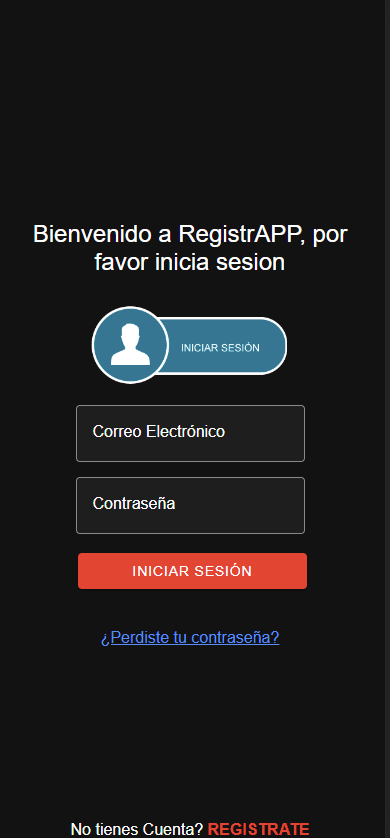
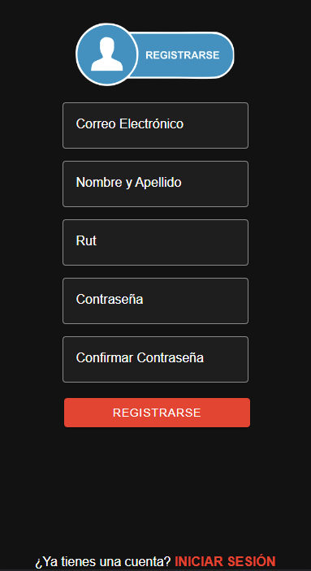
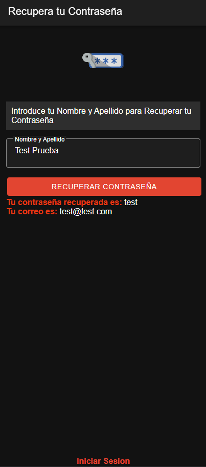
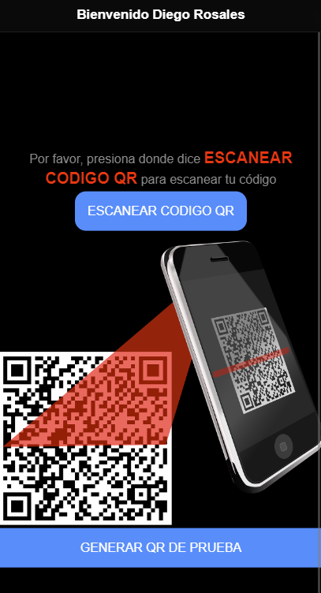

# RegistrAPP-Examen-P1
 
## Desde que se instalo Cordova aparecio un error en las Dependencias.
* Para Poder Solucionarlo solo se debe hacer.

 * `npm install --legacy-peer-deps`

## 🎨 Imagenes

<h4 align="center"> 
  
  
  
  
</h4>

··NO TOMAR EN CUENTA··
* npm i cordova-plugin-cszbar --legacy-peer-deps
* npm i @ionic-native/zbar --legacy-peer-deps
* npm install @ionic-native/core --legacy-peer-deps

## Luego de esto todo estara en orden.
